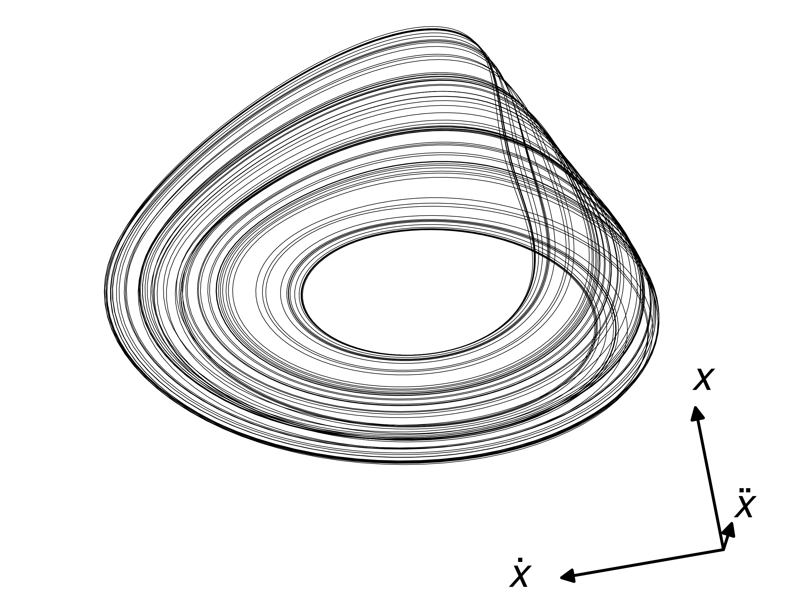
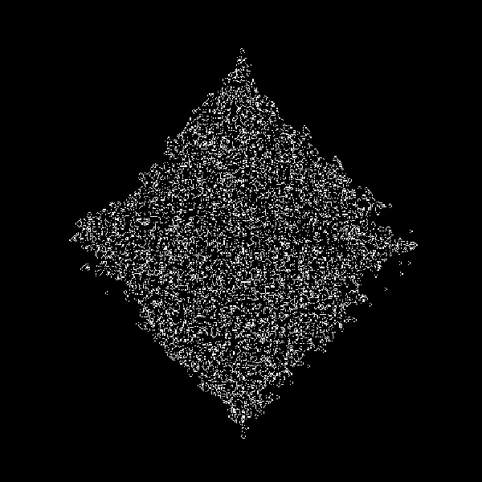

# Dynamical Systems

Work done for the elective course of Dynamical Systems under prof. Mario Cosenza at Yachay Tech during the first semester of 2025.

  

This repository contains all my solutions for the assignments along with the code (both Python and Latex), and my final project, *Arietta*, a Python module which allows to implement all cases of both elementary and life-like cellular automata. The PDF file for the presentation can also be found in the respective folder.   

  

I'm quite happy with the course and the work done. It was wonderful!
